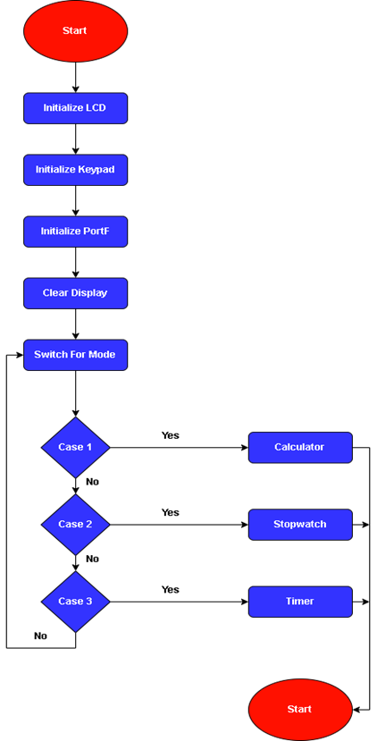
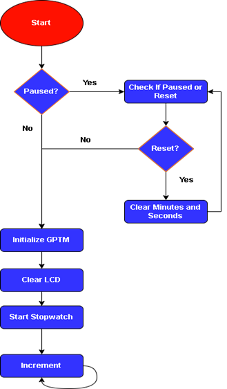
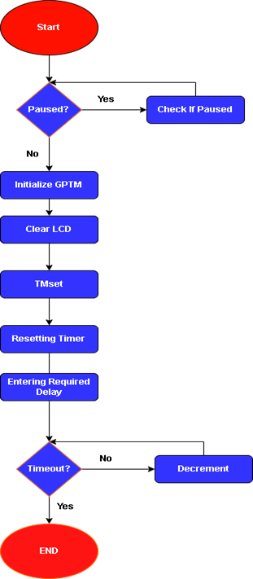

# TivaC Embedded Systems Project

## Links
- **Github Repository**: [Project on GitHub](https://github.com/Omar-Mohamed-Ibrahim-Alsayed/TivaC-embedded-systems-project)
- **Google Drive**: [Code on Google Drive](https://drive.google.com/drive/folders/13GQw1VoO7xu5nyV1h9qRMcdAJnycDixN?usp=sharing)
- **User Guide Video**: [Watch Video](https://youtu.be/mP-zvlVB7Kk)

## 1. Introduction
This project aims to develop a simple calculator with additional features: a timer and a stopwatch. The calculator supports basic operations including addition, subtraction, multiplication, and division. The user interacts with the device through an LCD display and a matrix keypad.

## 2. Flow Charts
### Calculator Mode
- Main flow chart depicting the operation of the calculator mode.
 

### Stopwatch
- Flow chart detailing the operation of the stopwatch feature.
  

### Timer
- Flow chart outlining the functionality of the timer.
-  

## 3. Problems Faced
- Handling floating points in calculator mode necessitated adding a new state in the FSM.
- Error handling for unexpected inputs in calculator mode.
- Order of operations (multiplication and division before addition and subtraction) in calculator mode.
- Conversion of keypad inputs from characters to integers for calculator use.
- Handling unexpected inputs in the main menu.
- Ensuring lower priority for timers interrupts compared to push button interrupts in stopwatch and timer modes.

## Conclusion
This project showcases the implementation of a multifunctional device using TivaC microcontroller, providing practical insights into embedded systems development.

